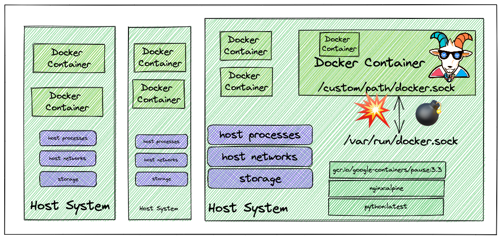

## 🙌 Overview

In this scenario, we will be focusing on the common and standard ways how to build systems and pipelines that leverage container sockets to create, build and run containers from the underlying container runtime. This has been exploited since the early days of the container ecosystem and even today we see these misconfigurations/use cases in the real world. 

By the end of the scenario, we will understand and learn the following

1. You will learn to test and exploit the container UNIX socket misconfigurations
2. Able to exploit container and escape out of the docker container
3. Learn common misconfigurations in pipelines and CI/CD build systems