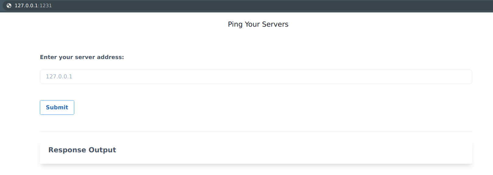

## Getting started

In this scenario, we have a service Health Check deployed on Kubernetes that serves a web page. Navigate to the service page here: [Health Check service page]({{TRAFFIC_HOST1_1234}}) and explore its functionality.

  
<b>✨ Bad gateway? </b>

  

    
Ensure pods are running then rerun the expose service script

  

