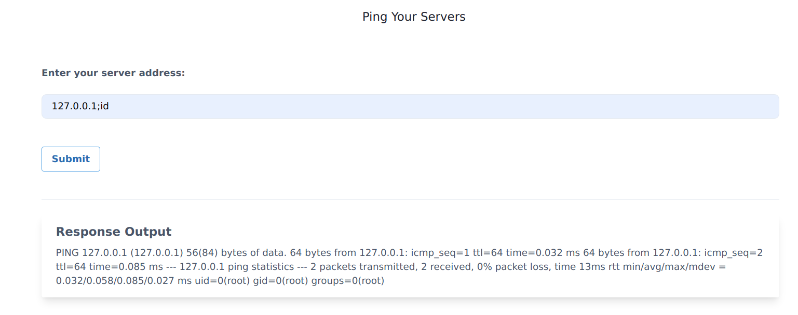
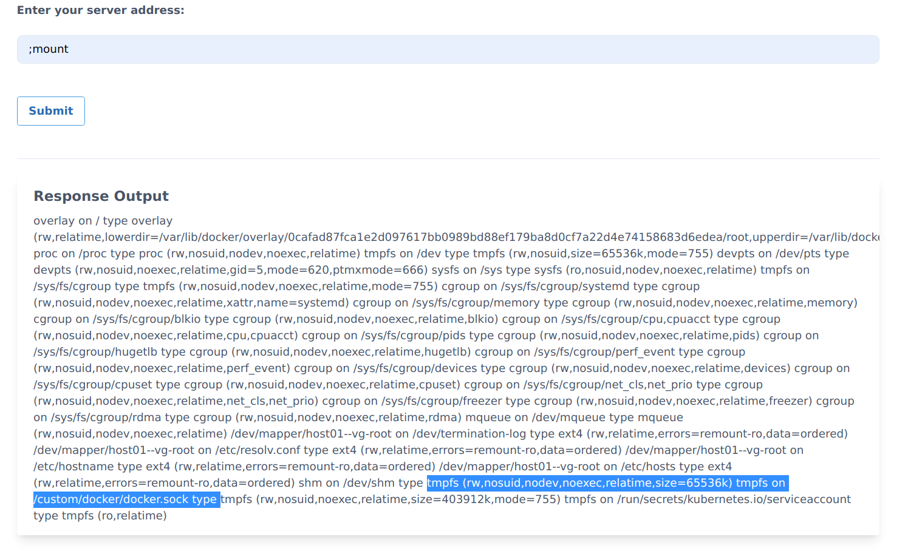

## 🎉 Solution & Walkthrough

### 🎲 Method 1

* Start by checking that DNS resolution is working for your cluster. If this doesn't work, check to see if you have a DNS service like CoreDNS running on your cluster.

```bash
www.google.com
```

:::tip
* if you get your local domain appended, try using

```bash
www.google.com.
```

* If you have to do this, you should always add a . after a url, even in wget commands. The extra dot is required is that kubernetes has a default option of ndots:5 in /etc/resolv.conf, which is verifiable in this scenario. This means that unless a minimum of 5 dots are present, the domain is not assumed to be a FQDN.
:::


* By looking at the application functionality and dabbling with the input and output, we can see it has standard command injection vulnerability. Assuming it's running in a Linux container we can use the `;` delimiter to run/pass other commands

```bash
127.0.0.1; id
```



* As we can see it returns the response for the `id` command, now we can analyze the system and see what potential information we can obtain

* It contains `docker.sock` mounted into the file system as it's not available commonly in standard systems

```bash
; mount
```



* Wow! we can see the `/custom/docker/docker.sock` mounted in the file system and assuming it's mounted from the host system we need to talk to it for communicating with the UNIX socket

:::tip

We can use multiple methods for communicating with the `docker.sock` UNIX socket. Some of them include [official docker binary](https://download.docker.com/linux/static/stable/), or a simple `curl` program as well.  

:::