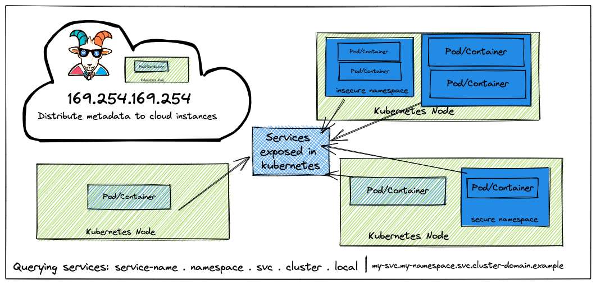

## 🙌 Overview

This scenario is to showcase the popular application security vulnerability getting exploited everywhere in the cloud environments. Now we will try to see how it impacts the Kubernetes clusters, internal services, and microservices as well. This has quite a large impact in cloud native environments, one of the real-world examples include [Shopify - SSRF in Exchange leads to ROOT access in all instances](https://hackerone.com/reports/341876).

By the end of the scenario, we will understand and learn the following

1. How to exploit SSRF vulnerabilities in applications in cloud environments
2. Learn to understand the metadata query features to gain access to cloud provider data
3. Understand and leverage Kubernetes native service discovery features and service DNS queries
4. Gain access to internal microservices within-cluster environments

Please wait till setup is completed