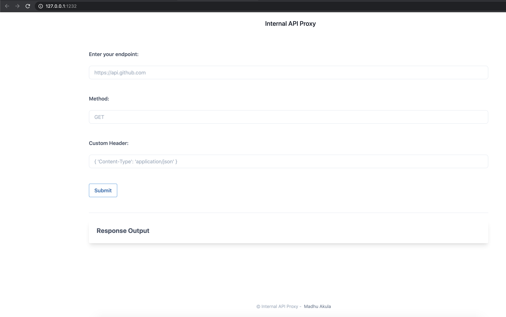

### ⚡️ The story

SSRF (Server Side Request Forgery) vulnerability became the go-to attack for cloud native environments. Here in this scenario, we will see how we can exploit an application vulnerability like SSRF to gain access to cloud instance metadata as well as internal services metadata information. Especially we see the power of native features in Kubernetes like service discovery to leverage and gain access to other internal microservices access.

:::info

To get started with the scenario, navigate to [service page]({{TRAFFIC_HOST1_1232}})

:::

