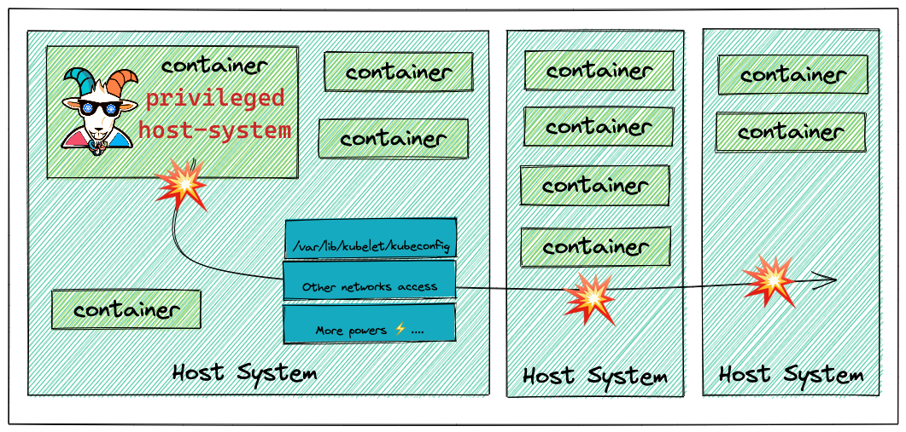

## 🙌 Overview

This scenario showcases the common misconfigurations and one of the error-prone security issues in Kubernetes, container environments, and the general security world. Giving privileges that are not required for things always makes security worse. This is especially true in the containers and Kubernetes world. You can also apply this scenario further and beyond the container to other systems and services based on the configuration and setup of the cluster environments and resources. In this scenario you will see a privileged container escape to gain access to the host system.

By the end of the scenario, you will understand and learn the following:

1. Able to exploit the container and escape out of the docker container
2. You will learn to test and exploit the misconfigured and privileged containers
3. Learn about common misconfigurations and possible damage due to them for the containers, Kubernetes, and clusterized environments