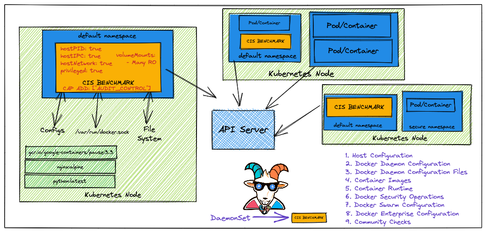

## 🙌 Overview

This scenario is very useful in performing container security audits and assessments. Here we will learn to run the popular CIS benchmark audit for the docker containers and use the results for the further exploitation or fixing of the misconfigurations and vulnerabilities. This is very important if you are coming from an audit and compliance background in the modern world of containers and cloud native ecosystems.

By the end of the scenario, we will understand and learn the following

1. To perform CIS benchmark audit for Docker containers
2. Working with Daemonset, Pods in Kubernetes, and other resources in the cluster
3. Gain visibility of the entire Container security posture and understand the risks
