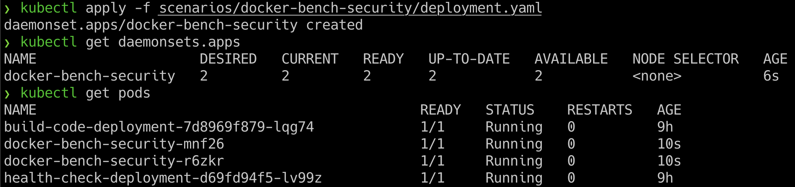
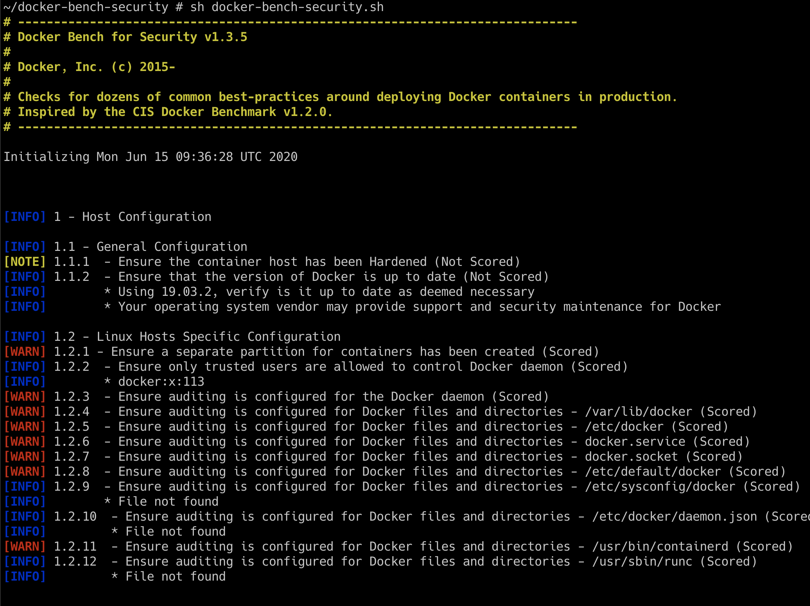

## 🎉 Solution & Walkthrough

### 🎲 Method 1

* We can deploy the Docker CIS benchmarks by running the following command

```bash
kubectl apply -f scenarios/docker-bench-security/deployment.yaml
```

* Then we can list the running pods from the DaemonSet by running the following command

```bash
kubectl get pods
```



* Now we can see pods are running with `docker-bench-security-xxxxx` and we can use one of the pods and exec into it for performing the audit

* Access the `docker-bench-security-xxxxx` pod by running the following command

```bash
kubectl exec -it docker-bench-security-xxxxx -- sh
```

* The docker-bench-security is already installed inside the container and you can navigate to the respective directory for performing the scan

```bash
cd docker-bench-security
```

* We can run the following command to start the Docker CIS benchmarks script for audit

```bash
sh docker-bench-security.sh
```

