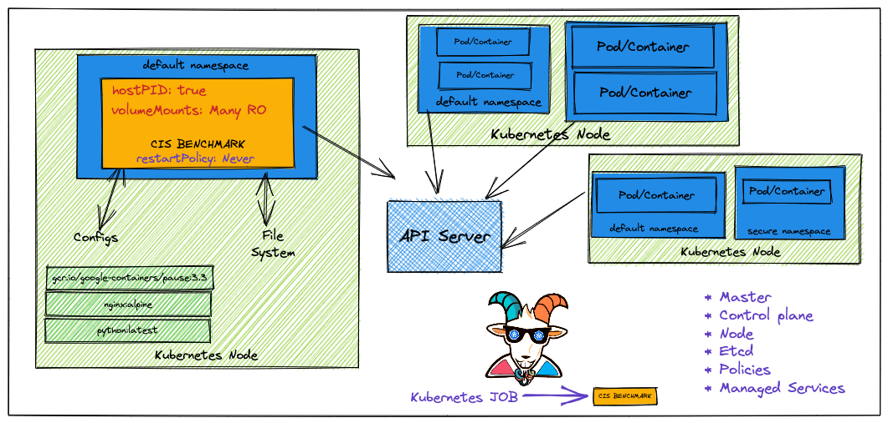

## 🙌 Overview

This scenario is very useful in performing Kubernetes security audits and assessments. Here we will learn to run the popular CIS benchmark audit for the Kubernetes cluster and use the results for the further exploitation or fixing of the misconfigurations and vulnerabilities. This is very important and mandates if you are coming from an audit and compliance background in the modern world of containers, Kubernetes, and cloud native ecosystems.

By the end of the scenario, we will understand and learn the following

1. You will learn to perform CIS benchmark audit for Kubernetes clusters
2. Working with jobs, Pods in Kubernetes, and other resources in the cluster
4. Gain visibility of the entire Kubernetes cluster security posture and understand the risks