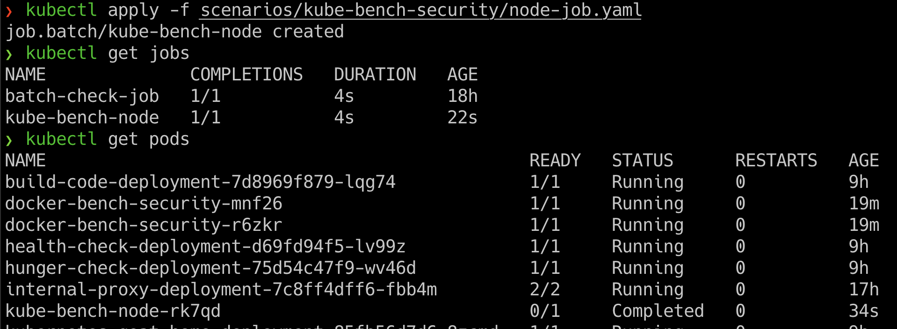
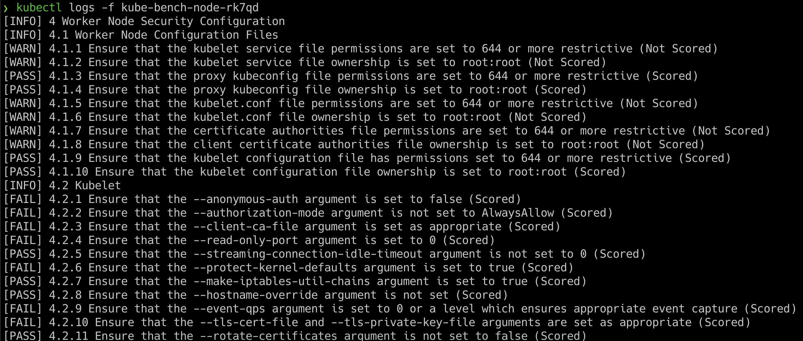

## 🎉 Solution & Walkthrough

### 🎲 Method 1

* We can deploy the Kubernetes CIS benchmarks by running the following command

```bash
kubectl apply -f scenarios/kube-bench-security/node-job.yaml
```

* Now we can obtain the list of jobs and associated pods information by running the following command

```
kubectl get jobs
```

```bash
kubectl get pods
```



* Once we have identified the pod, then we can get the audit results by running the following command. Make sure to replace the pod name in the following command

```bash
kubectl logs -f kube-bench-node-xxxxx
```



