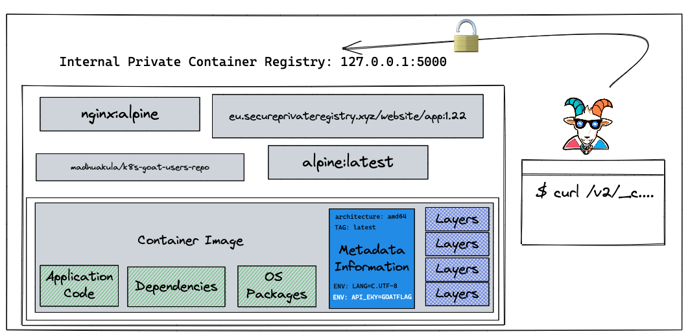

## 🙌 Overview

In this scenario, we will see one of the misconfigurations of Docker container private registries and how we can obtain and gain access to the images and their content. There was a popular hack around this in the early days of containers where vine (Twitter acquired now) got hacked and the entire source code of the product was leaked due to this simple misconfiguration. Also, we see a ton of similar cases even today but with authenticated registries as well and misconfigured permissions and privileges.

By the end of the scenario, we will understand and learn the following

1. How to interact with Docker container registry API
2. Able to introspect the container registry API, container images, and manifests
3. Understand how container metadata gets stored and interacts with the layers
