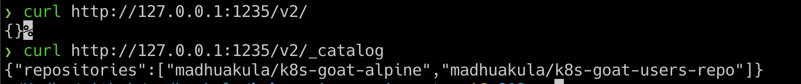
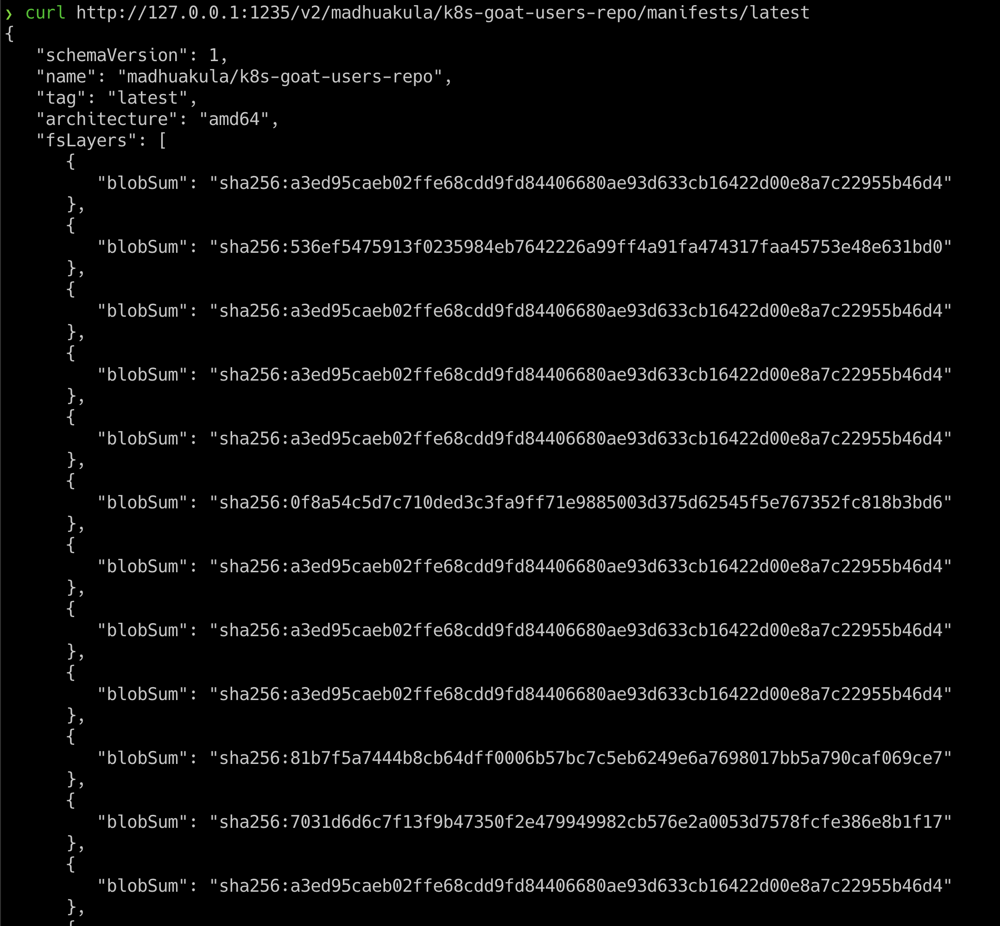
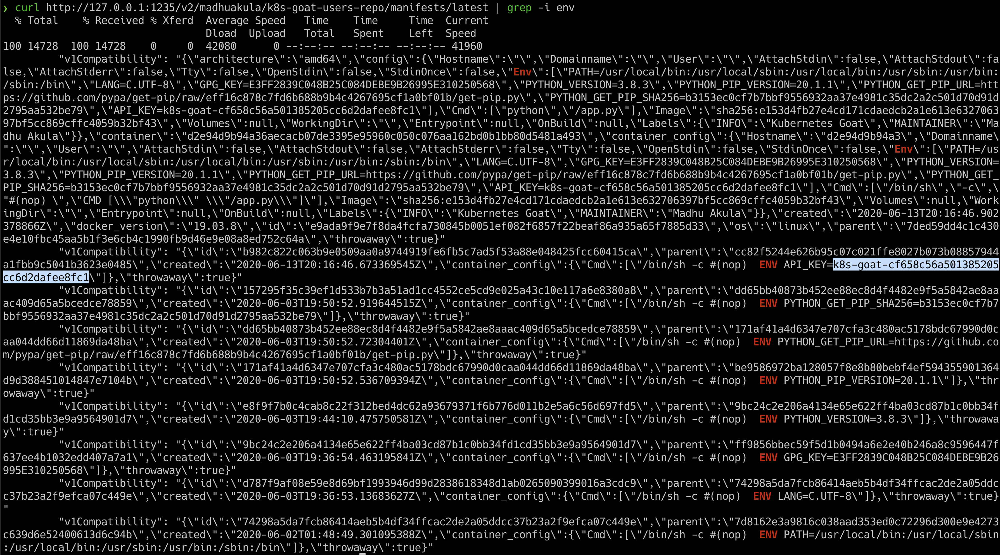

## 🎉 Solution & Walkthrough

### 🎲 Method

:::note

As this is an intentionally vulnerable design, we directly provided the endpoint. In the real world, you have to do some recon or even need to exploit the authenticated registries by a combination of other vulnerabilities chains.

:::

* Based on the scenario and information, we can identify that it's possible docker container private registry

* After reading some documentation and googling, here are the simple API endpoint queries for talking to the container registry

* To query the registry API v2 

```bash
curl http://127.0.0.1:1235/v2/
```

* The following endpoint is to query the catalog information, which returns all the details of images available in the container registry

```bash
curl http://127.0.0.1:1235/v2/_catalog
```



* We can get more information about the specific image using the image name with a tag with a manifest endpoint

```bash
curl http://127.0.0.1:1235/v2/madhuakula/k8s-goat-users-repo/manifests/latest
```



* Now we can see this container image has ENV variables that contain API key information, so we can quickly `grep` that out

```bash
curl http://127.0.0.1:1235/v2/madhuakula/k8s-goat-users-repo/manifests/latest | grep -i env 
```



### Troubeshooting
Curl [service page]({{TRAFFIC_HOST1_1235}}) instead