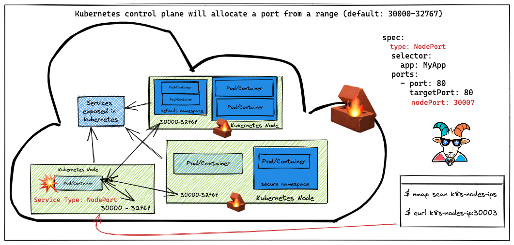

## 🙌 Overview

In this scenario, we see another misconfiguration that may give attackers access to internal services and non-exposed services. This is one of the simple misconfigurations made when creating the Kubernetes services and also the cluster setup and configurations.

By the end of the scenario, we will understand and learn the following

1. How Kubernetes `NodePort` works, configuration, and the ranges
2. Performing the portscan and interacting with Kubernetes nodes