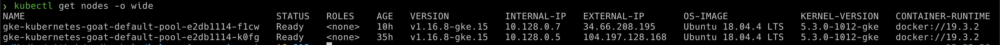
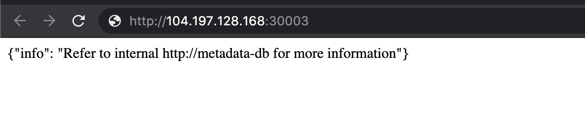

## 🎉 Solution & Walkthrough

### 🎲 Method 1

:::caution

This vulnerability/attack varies depending on how the Kubernetes cluster has been configured. If your Kubernetes cluster is configured with firewalling and blocking the nodes exposed ports, then this scenario might not work for you but the concepts are the same 😊

:::

* Get the list of Kubernetes nodes external IP addresses information by running the following command

```bash
kubectl get nodes -o wide
```



:::tip

Now, let's find out the open ports. In this case, you can use your traditional security scanning utilities like `nmap`

:::

* Once we identified that there is a NodePort exposed, we can just verify by connecting and accessing it

```bash
nc -zv EXTERNAL-IP-ADDRESS 30003
```


