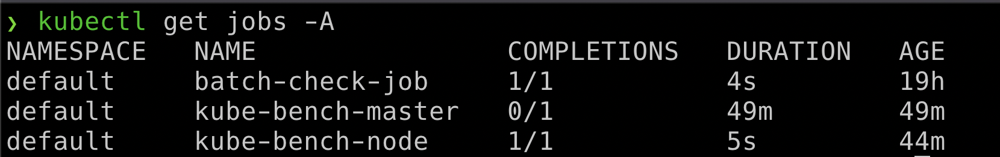

### ⚡️ The story

Crypto mining has become popular with modern infrastructure. Especially environments like Kubernetes are an easy target as you might not even look at what exactly the container image builds upon and what it is doing with proactive monitoring. Here in this scenario, we will analyze and identify the crypto miner.

:::info

* To get started, identify all the resources/images in the Kubernetes cluster including jobs

```bash
kubectl get jobs
```

:::

