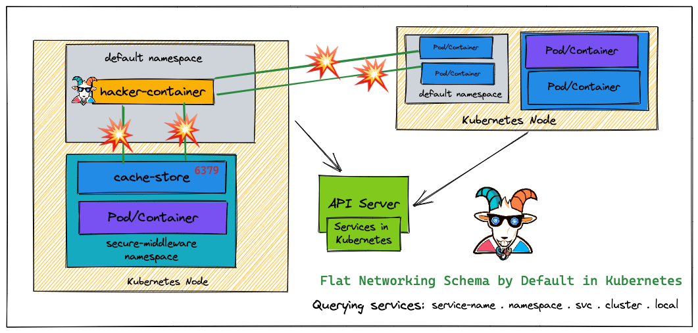

## 🙌 Overview

Woah! this is a big misconception in the Kubernetes world. Most people assume that when there are different namespaces in Kubernetes and resources are deployed and managed they are secure and not able to access each other. Many real-world multi-tenant environments are getting exploited and critical resources are exposed internally due to this. By default, Kubernetes comes with flat networking schema and if we need to have segmentation then we have to create them by creating certain boundaries like NSP (network security policies) and others. In this scenario, we see how we can bypass the namespaces and access other namespaces resources.

By the end of the scenario, we will understand and learn the following

1. You will understand the misconception of the Kubernetes namespaces
2. Learn about the Kubernetes networking flat schema and communicating across namespaces
3. Performing the reconnaissance and testing for the network port scanning and vulnerabilities
4. Gaining access to other namespaces resources bypassing the namespaces restrictions