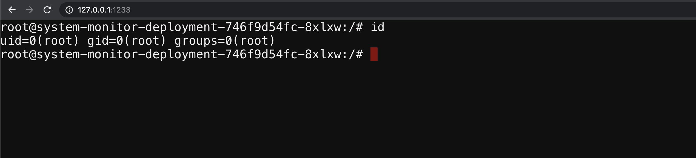

### ⚡️ The story

Each environment in Kubernetes will have a lot of information to share. Some of the key things include secrets, API keys, configs, services, and a lot more. So let's go ahead and find the vault key!

:::info

To get started with the scenario, navigate to [service page]({{TRAFFIC_HOST1_1233}})
:::

