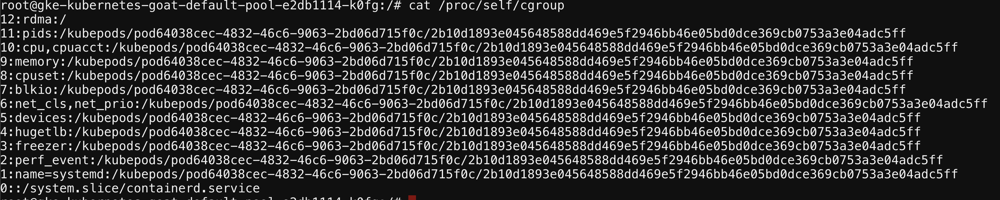
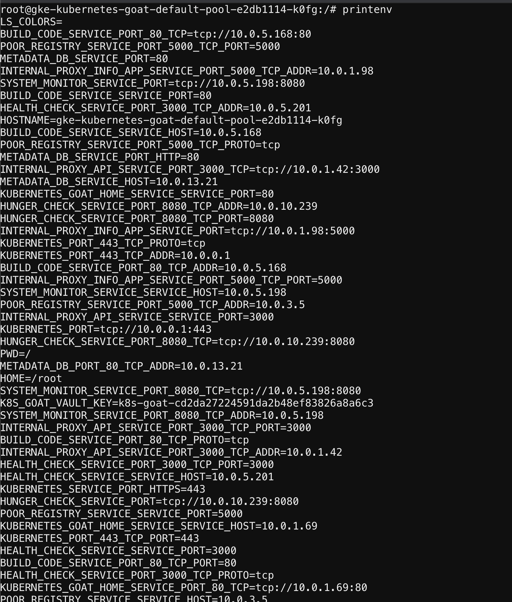

## 🎉 Solution & Walkthrough

### 🎲 Method 1

* We can explore the container by running different commands and understand the system much better. This is more like an exploration scenario to explore the container and understand it better

* We can get the container runtime information by running the below command

```bash
cat /proc/self/cgroup
```



* We can get the information of the container host's information

```bash
cat /etc/hosts
```

* We can get the mount information

```bash
mount
```

* We can also look and explore the file system

```
ls -la /home/
```

* We can access the environment variables, including Kubernetes secrets mounted and service names, ports, etc.

```bash
printenv
```

