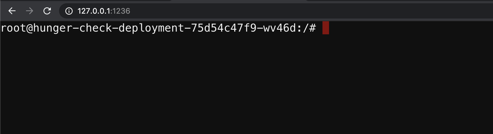

### ⚡️ The story

There is no specification of resources in the Kubernetes manifests and no applied limit ranges for the containers. As an attacker, we can consume all the resources where the pod/deployment running and starve other resources and cause a DoS for the environment.

:::info

To get started with the scenario, navigate to [service page]({{TRAFFIC_HOST1_1236}})

:::

