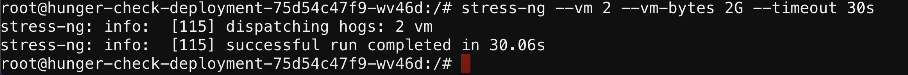
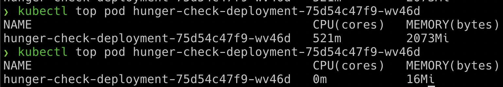

## Scenario Solution

* This deployment pod has not set any resource limits in the Kubernetes manifests. So we can easily perform the bunch of operations which can consume resources
* In this pod we have installed a utility called `stress-ng`

```bash
stress-ng --vm 2 --vm-bytes 2G --timeout 30s
```



* You can see the difference between while running `stress-ng` and after

```bash
kubectl top pod hunger-check-deployment-xxxxxxxxxx-xxxxx
```



> This attack may not work in some cases like autoscaling, resource restrictions, etc. Also, it may cause more damage when there are autoscaling is enabled and creating more resources and making more expensive bills to the cloud provider or impacting the availability of the resources and services.