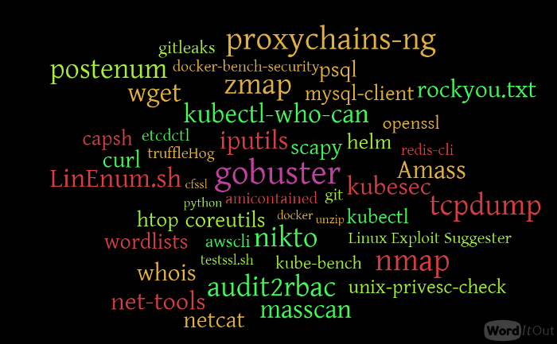

## 🙌 Overview

While performing and testing container or Kubernetes infrastructure, we always have to install some common tools inside a container to perform further exploitation and later moved within the cluster. So Hacker Container is a simple alpine-based docker container with commonly used tools and utilities while performing security assessments for containerized and Kubernetes cluster environments.

By the end of the scenario, we will understand and learn the following

1. How to work with hacker-container and explore multiple common security tools, commands
2. Learn to use the hacker container for enumeration, exploitation, and post-exploitation
