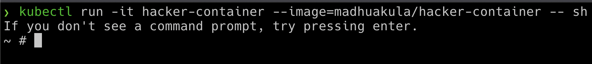

### ⚡️ The story

This scenario is just an exploration of the common security utilities inside the Kubernetes Cluster environment. I think by this time you might have already used hacker-container multiple times.

:::info

* To get started with this scenario, run the hacker container using the following command

```bash
kubectl run -it hacker-container --image=madhuakula/hacker-container -- sh
```

:::


