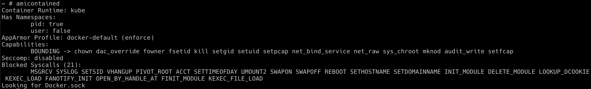
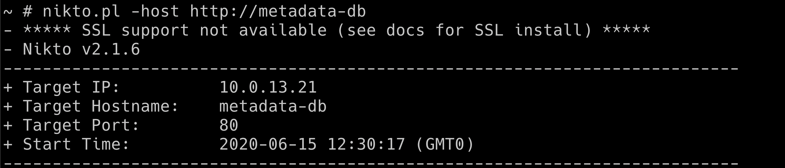

## 🎉 Solution & Walkthrough

### 🎲 Method 1

:::info

Hacker Container is a utility with a list of useful tools/commands while hacking Kubernetes Clusters. So there is no limit to your exploration of Kubernetes environments. Here we will see some of the most useful and powerful utilities

:::

* We can use a simple and powerful utility like `amicontained` to perform the container introspection and get an overview of the system capabilities, etc.

```bash
amicontained
```



* Performing Nikto scan against internal services using hacker-container

```bash
nikto.pl -host http://metadata-db
```


