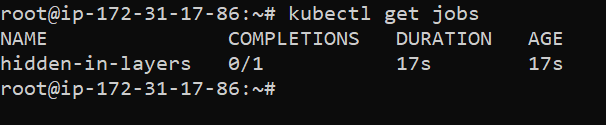

### ⚡️ The story

Sensitive information disclosure is one of the most common vulnerabilities existing in the wild. Mishandling of passwords, private keys, tokens, etc in the containerization world is easy. Here in this scenario, we will analyze and identify one of such mishandled bad practices that leads to sensitive information disclosure.

:::info

* To get started with the scenario, run the following command and explore the `hidden-layers` job

```bash
kubectl get jobs
```

:::

