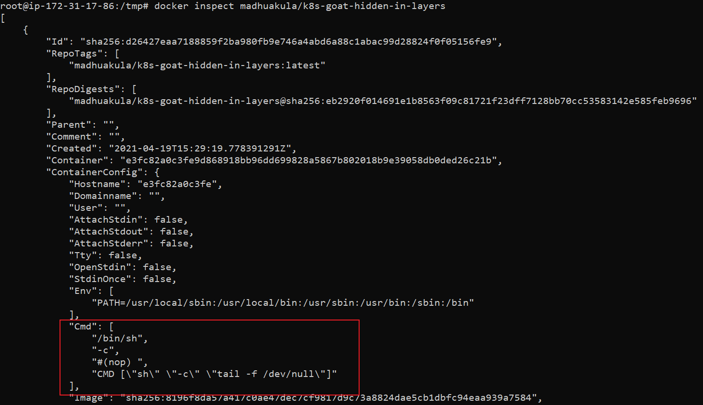

## 🎉 Solution & Walkthrough

:::info

Try exploring all files, environment variables, etc in the running container. Next, try to analyze the image used above with different tools to find exposed sensitive information.

:::

* Docker CLI is an amazing tool with lots of features, let's start with inspecting the image

```bash
docker inspect madhuakula/k8s-goat-hidden-in-layers
```



* We can observe the `cmd` section in the above output. It shows the default command executed by this image on startup. Though this shows some interesting information, it's not good enough for us

* Maybe it would be more helpful for us if we get to know how this image is built from scratch. For that, we need to analyze the `Dockerfile` of the image. If you have `Dockerfile`, it's good. If not, there are a few ways to analyze it
