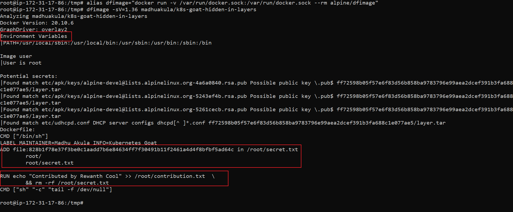

### 🎲 Method 2

* We can use the `dfimage` to generate a Dockerfile of any given image. First, we can set up that and perform it by running the following commands

```bash
alias dfimage="docker run -v /var/run/docker.sock:/var/run/docker.sock --rm alpine/dfimage"
```

```bash
dfimage -sV=1.36 madhuakula/k8s-goat-hidden-in-layers
```


