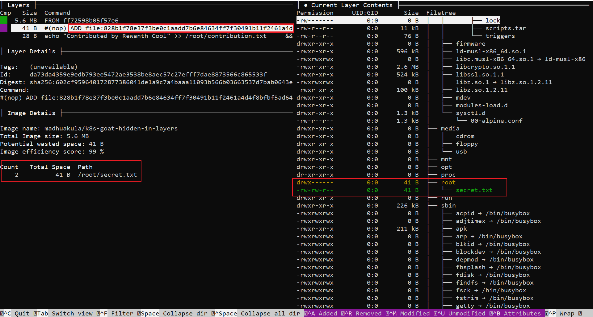
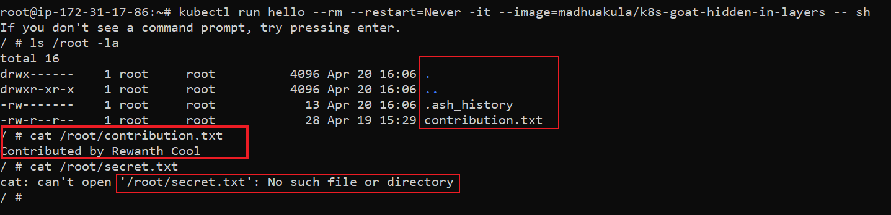
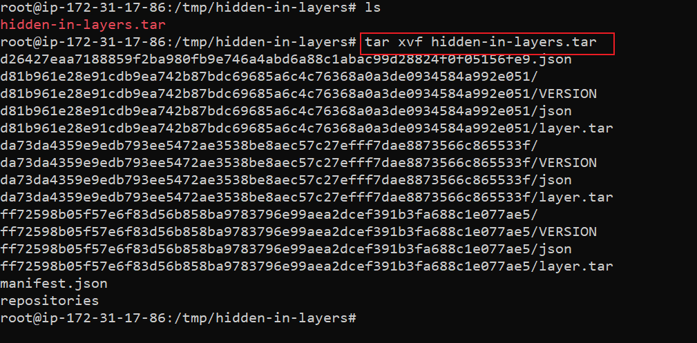
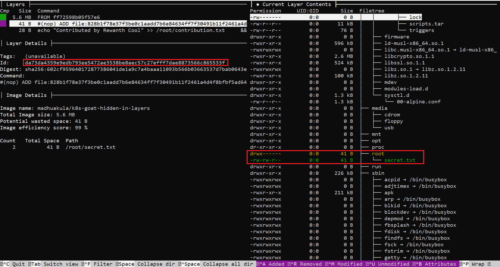
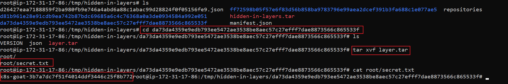

### 🎲 Method 3

* [`dive`](https://github.com/wagoodman/dive) is an amazing tool that helps with analyzing each layer of an image



:::note

From all the above analyses, we can see some significant changes in these two files, `/root/contributions.txt`, `/root/secret.txt`. The above methods cannot help us to read the contents of these files. Let's see if we can find these files in the running container.

:::



* We can't see `/root/secret.txt` as it is deleted from the next layers. We can recover the `/root/secret.txt` by leveraging the docker built-in command to export the docker image as a tar file

```bash
docker save madhuakula/k8s-goat-hidden-in-layers -o hidden-in-layers.tar
```

* Now we have the artifact and we can extract the tar file to explore the layers

```bash
tar -xvf hidden-in-layers.tar
```



:::tip

We can see each layer getting exported as a single tar file. We have 3 layers in this image, so we have 3 tar files. Since we have only 3 layers, it's easy to extract all of them and check the contents but that's not the conventional approach. What if we have hundreds of layers?

:::

* Let's review the dive output again. In the below image, we saw a new file, `/root/secret.txt` is being created 



* Observe the `Id` of that layer, `da73da4359e9edb793ee5472ae3538be8aec57c27efff7dae8873566c865533f`. Since, we have `/root/secret.txt` created in this layer, let's extract the tar file of this layer first

```bash
cd da73da4359e9edb793ee5472ae3538be8aec57c27efff7dae8873566c865533f
```

```bash
tar -xvf layer.tar
```

```bash
cat root/secret.txt
```

