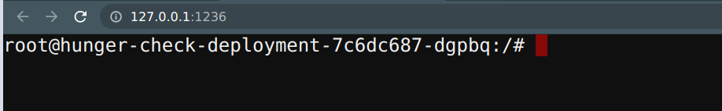

### ⚡️ The story

We commonly see in the real world where developers and DevOps teams tend to provide extra privileges than required. This provides attackers more control and privileges than they intended to be. In this scenario, you can leverage the service account bound to the pod to provide `webhookapikey` access, but using this attacker can gain control over other secrets and resources.

:::info

To get started with the scenario, navigate to [service page]({{TRAFFIC_HOST1_1236}})

:::

