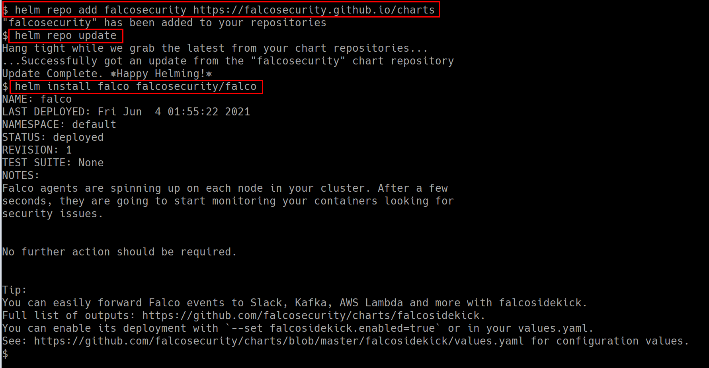

### ⚡️ The story

This scenario is to deploy runtime security monitoring & detection for containers and Kubernetes resources. Also, explore and see how we can detect certain issues and perform detection rules analysis based on triggers.

:::note

Make sure you run the following deployment using Helm with v3. Refer to [helm installation](https://helm.sh/docs/helm/helm_install/)

:::

:::info

* To deploy the Falco helm chart run the following commands

```bash
helm repo add falcosecurity https://falcosecurity.github.io/charts
```

```bash
helm repo update
```

```bash
helm install falco falcosecurity/falco
```

:::


