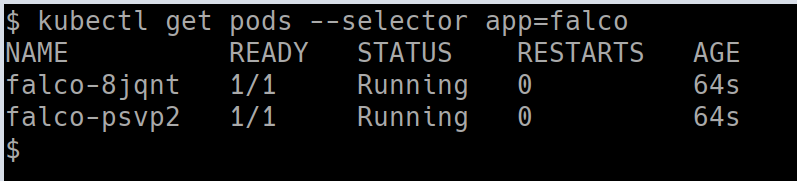

## 🎉 Solution & Walkthrough

### 🎲 Method 1

:::info

`Falco`, the cloud-native runtime security project, is the de facto Kubernetes threat detection engine. Falco was created by Sysdig in 2016 and is the first runtime security project to join CNCF as an incubation-level project. Falco detects unexpected application behavior and alerts on threats at runtime.

:::

* Falco uses system calls to secure and monitor a system, by:

  * Parsing the Linux system calls from the kernel at runtime
  * Asserting the stream against a powerful rules engine
  * Alerting when a rule is violated

* Falco ships with a default set of rules that check the kernel for unusual behavior such as:

  * Privilege escalation using privileged containers
  * Namespace changes using tools like `setns`
  * Read/Writes to well-known directories such as /etc, /usr/bin, /usr/sbin, etc
  * Creating symlinks
  * Ownership and Mode changes
  * Unexpected network connections or socket mutations
  * Spawned processes using execve
  * Executing shell binaries such as sh, bash, csh, zsh, etc
  * Executing SSH binaries such as ssh, scp, sftp, etc
  * Mutating Linux coreutils executables
  * Mutating login binaries
  * Mutating shadowutil or passwd executables such as shadowconfig, pwck, chpasswd, getpasswd, change, useradd, etc, and others.

* Get more details about the Falco deployment by running the following command

```bash
kubectl get pods --selector app=falco
```



* Manually obtaining the logs from the Falco systems using the following command

```bash
kubectl logs -f -l app=falco
```

* Now, let's spin up a hacker container and read a sensitive file and see if that detects by Falco

```bash
kubectl run --rm --restart=Never -it --image=madhuakula/hacker-container -- bash
```

* Let's read the sensitive file `/etc/shadow`

```bash
cat /etc/shadow
```