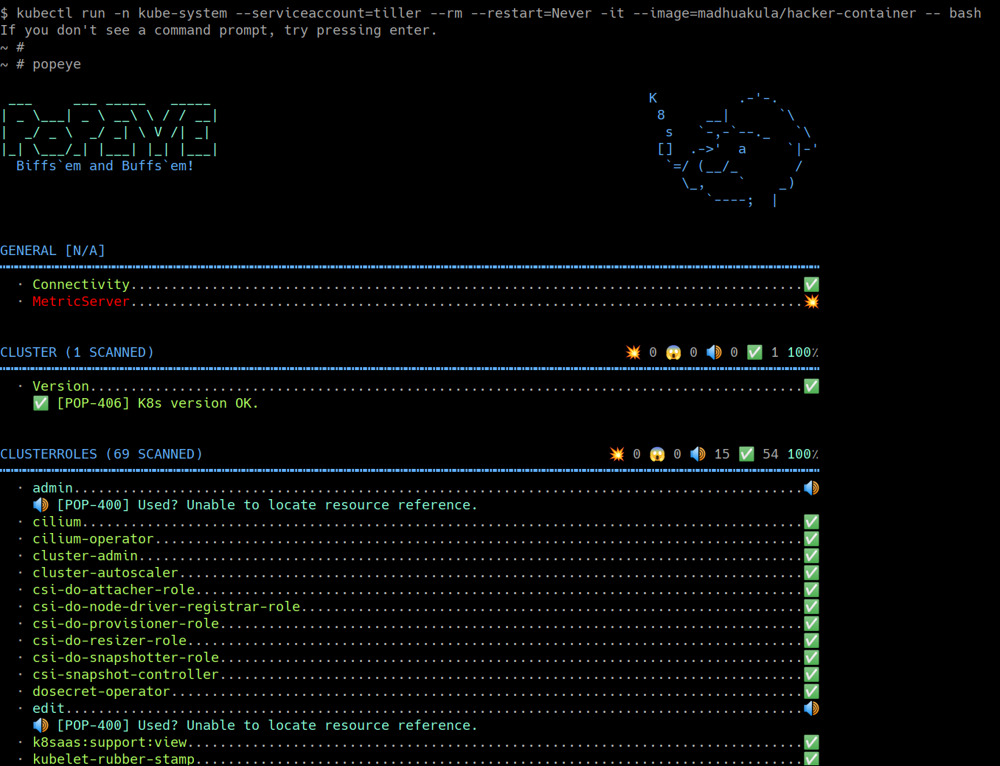

## 🎉 Solution & Walkthrough

### 🎲 Method 1

:::info

`Popeye` is a utility that scans live Kubernetes clusters and reports potential issues with deployed resources and configurations. It sanitizes your cluster based on what's deployed and not what's sitting on the disk. Scanning your cluster helps detect misconfigurations and helps you to ensure that best practices are in place, thus preventing future headaches.

:::

* Here is a list of some of the available sanitizers
  * Node
  * Namespace
  * Pod
  * Service
  * ServiceAccount
  * Secrets
  * ConfigMap
  * Deployment
  * StatefulSet
  * DaemonSet
  * PersistentVolume
  * PersistentVolumeClaim
  * HorizontalPodAutoscaler
  * PodDisruptionBudget
  * ClusterRole
  * ClusterRoleBinding
  * Role
  * RoleBinding
  * Ingress
  * NetworkPolicy
  * PodSecurityPolicy

:::info

Refer to [https://github.com/derailed/popeye](https://github.com/derailed/popeye) for more details about the project

:::

* To get started with this scenario you can run the following command to start the `hacker-container` with cluster administrator privileges (as the tiller service account already has that)

```bash
kubectl run -n kube-system --serviceaccount=tiller --rm --restart=Never -it --image=madhuakula/hacker-container -- bash
```

* Run the `popeye` in the cluster by using cluster-admin token privileges

```bash
popeye
```


