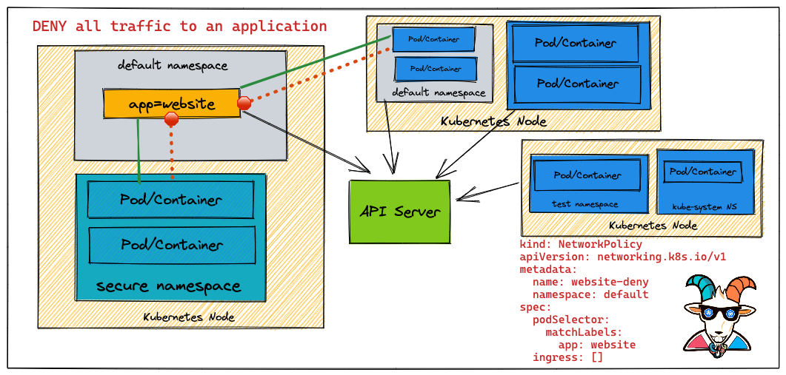

## 🙌 Overview

As you have seen in some of the scenarios and in general Kubernetes comes with a flat networking schema. This means if you wanted to create network boundaries, you will need to create something called a Network Policy with the help of CNI. In this scenario, we will be looking at a simple use case of how you can create a Network Policy to restrict traffic and create network security boundaries between Kubernetes resources.

By the end of the scenario, you will understand and learn the following:

1. You will learn to work with Network Policies in Kubernetes Cluster
2. Understand and work with basic Kubernetes `kubectl` commands and interact with pods & services
3. Creating and destroying Kubernetes resources and restricting the traffic using NSPs 
