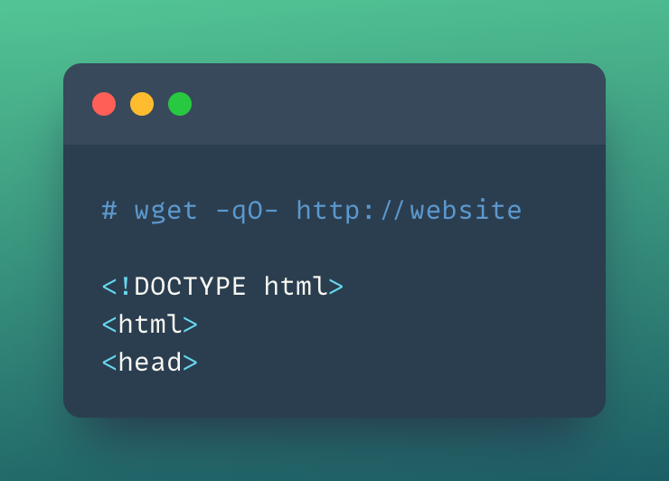
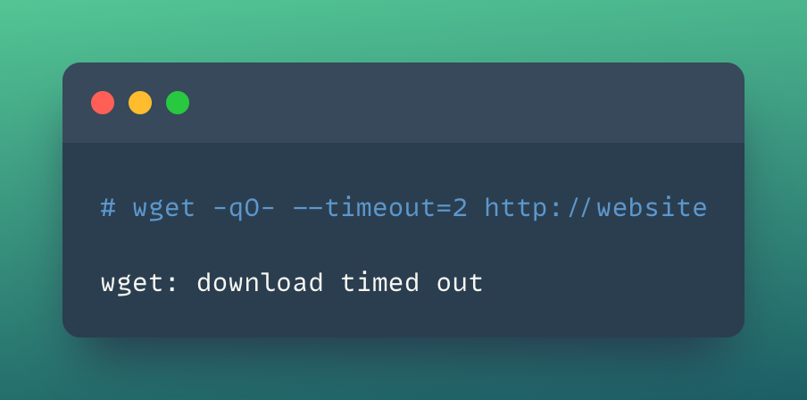

## 🎉 Solution & Walkthrough

### 🎲 Method 1

:::note

Refer to [https://github.com/ahmetb/kubernetes-network-policy-recipes](https://github.com/ahmetb/kubernetes-network-policy-recipes) for more recipes and a detailed explanation of Network Security Policies with examples and details.

:::

* Let's run the Nginx container with `app=website` labels and expose it via port 80

``` bash
kubectl run --image=nginx website --labels app=website --expose --port 80
```

* Now, let's run a temporary pod to make a simple HTTP request to the `website` service

```bash
kubectl run --rm -it --image=alpine temp -- sh
```

* Let's make a simple HTTP request using `wget` to the website service

```bash
wget -qO- http://website
```



* So far it works perfectly fine. Now let's create a Network Policy and apply it to the Kubernetes cluster to block/deny any requests.

```YAML title="website-deny.yaml"
kind: NetworkPolicy
apiVersion: networking.k8s.io/v1
metadata:
  name: website-deny
spec:
  podSelector:
    matchLabels:
      app: website
  ingress: []
```

* Let's deploy this NSP policy to the cluster by running the following command:

```bash
kubectl apply -f website-deny.yaml
```

* Now, let's retry a HTTP request to our `website` service

```bash
kubectl run --rm -it --image=alpine temp -- sh
```

* Let's run the `wget` query to access the website

```bash
wget -qO- --timeout=2 http://website
```


